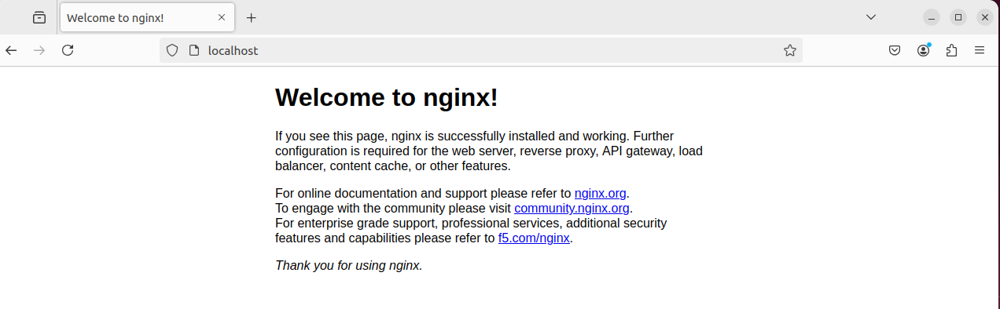
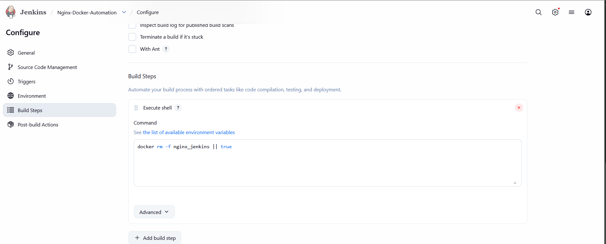
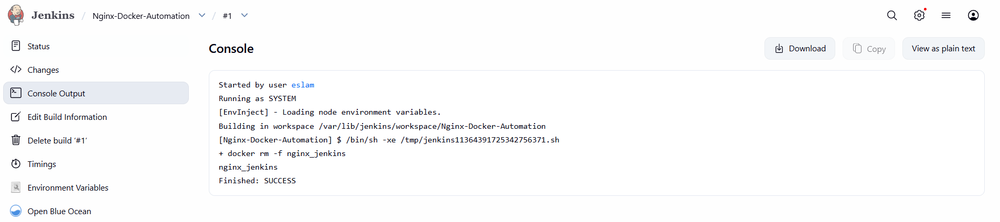
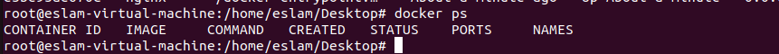
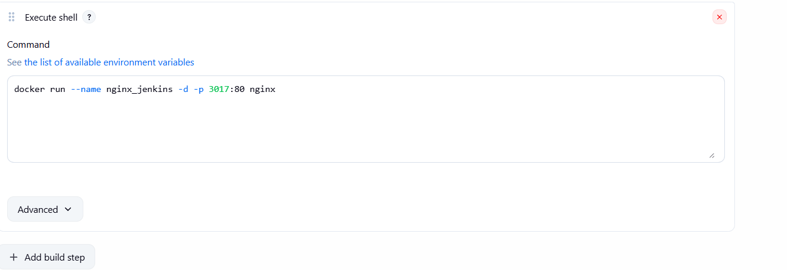
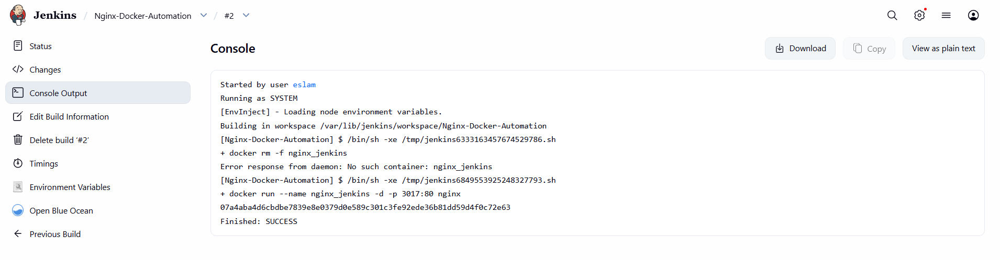
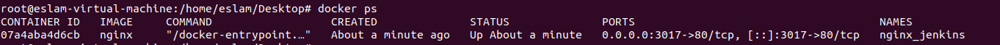
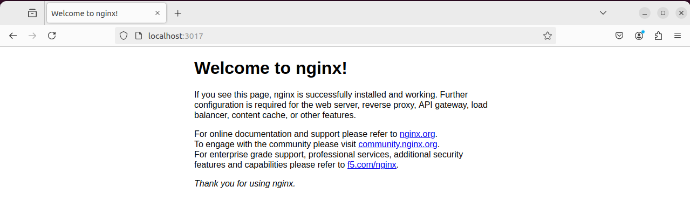

# Task 1: Jenkins Freestyle Basics

## Overview

In this task, we will explore the basics of Jenkins by performing a simple freestyle job. The job involves removing an existing Docker image of Nginx named `nginx_jenkins` and then recreating it with port mapping. This task demonstrates Jenkins' ability to interact with Docker and perform automated tasks.

## Prerequisites

- Docker installed on your system.
- Jenkins installed and running.
- Jenkins user added to the Docker group for permission to manage Docker containers.

## Instructions

### 1. Add Jenkins to Docker Group

To allow Jenkins to manage Docker containers, you must add the Jenkins user to the Docker group. Run the following command:

```bash
sudo usermod -aG docker jenkins
```

After adding Jenkins to the Docker group, restart the Jenkins service:

```bash
sudo systemctl restart jenkins
```

<p align="center">
  
  <br>
  <em><b>Figure 1:</b> Executing Docker Image</em>
</p>
                                              

                                              *Figure 2:Execting Docker Image check in web*

### 2. Remove Existing Nginx Docker Image

Create a Jenkins freestyle job that removes the existing Nginx Docker image named `nginx_jenkins`. Follow these steps:

1. Open Jenkins and create a new freestyle project.
2. In the build section, add an "Execute shell" build step.
3. In the shell script, enter the following command:

```bash
docker rm -f nginx_jenkins || true 
```
We used || true to prevent the job from failing if the container does not exist.


                                              *Figure 3:Removing Step In Freestyle*
                                              

                                              *Figure 4:Removing Step Success*
                                              

                                              *Figure 5:Removing Success Check In Terminal*
                                              
4. Save and run the job to remove the Nginx Docker image.
***
### 3. Recreate Nginx Docker Image

Next, recreate the Nginx Docker image and map port 80 to 3017:

1. Add another "Execute shell" build step to the same Jenkins job.
2. In the shell script, enter the following command:

```bash
docker run --name nginx_jenkins -d -p 3017:80 nginx
```


                                              *Figure 6:Creating Docker Container Freestyle Step*
                                              

                                              *Figure 7:Creating Docker Container Freestyle Step*
                                              
3. Save and run the job again to recreate the Nginx Docker image.

### 4. Verify the Nginx Container

After the job completes, you can verify that the Nginx container is running with the following command:

```bash
docker ps
```


                                              *Figure 8:Creating Docker Container Success Check In Terminal*


                                              *Figure 9:Creating Docker Container Success Check In Terminal* 
                                              
Look for a container named `nginx_jenkins` with port `3017` mapped to port `80`.

## Conclusion

This task demonstrated how to use Jenkins to automate Docker commands. By setting up a simple freestyle job, we successfully removed and recreated an Nginx Docker container, illustrating Jenkins' flexibility in managing Docker environments.
