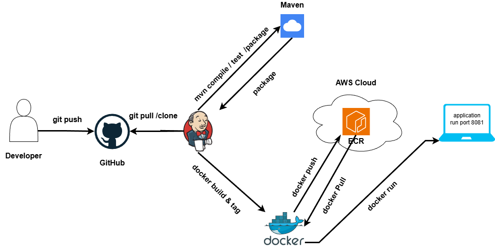
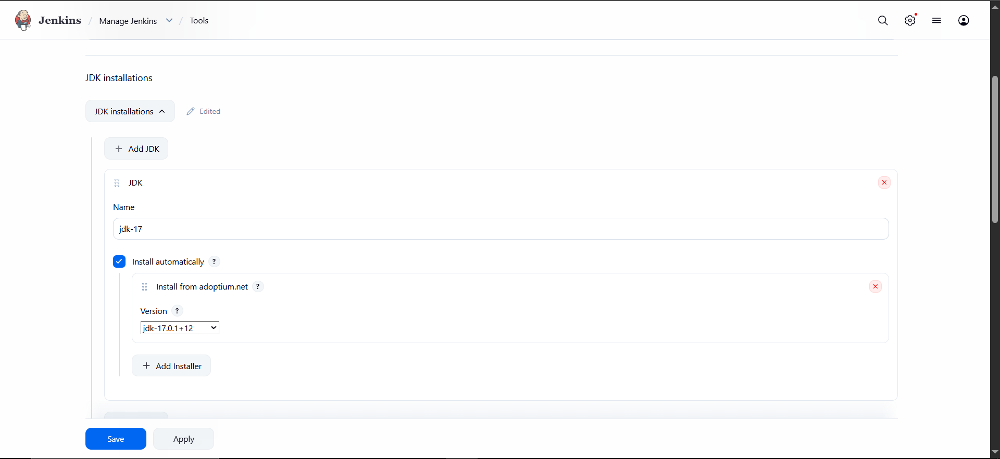
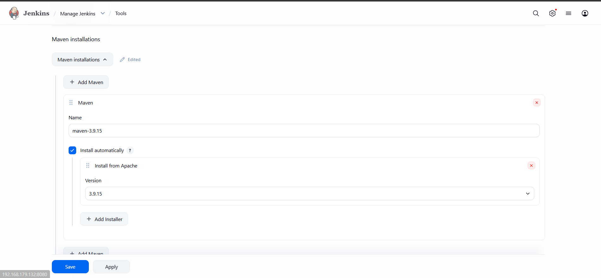
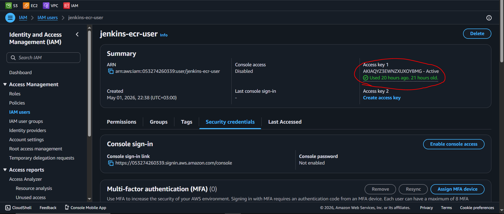
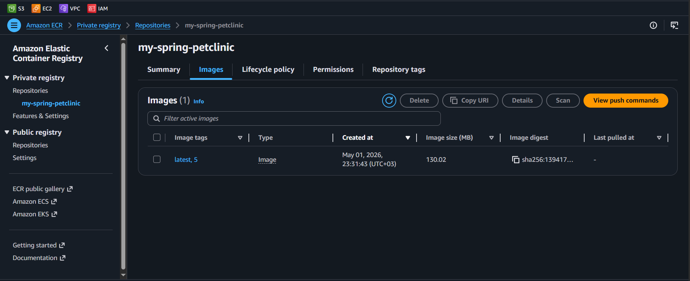
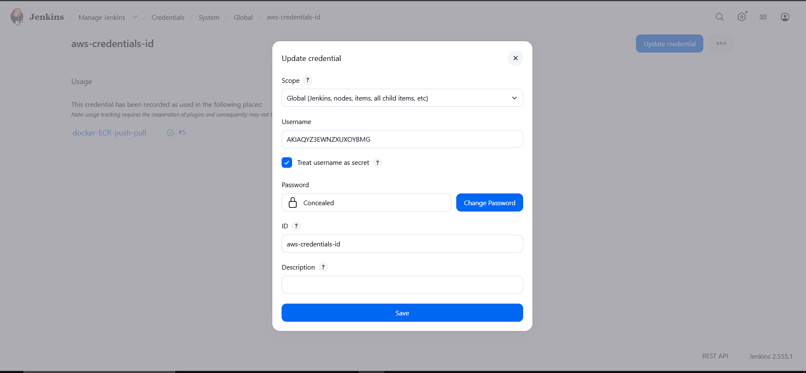

# Task 2: Jenkins Declarative Pipeline for Spring Petclinic (CI/CD to AWS ECR)

## Overview
This project demonstrates a full CI/CD pipeline for a Java Spring Boot application. The pipeline automates the entire lifecycle—from code integration to cloud-native deployment. Since the environment is local, the pipeline is triggered manually to pull the latest changes from GitHub, build the application, containerize it, and push it to AWS Elastic Container Registry (ECR).

## Project Architecture
The following diagram illustrates the technical flow and the integration between local tools (Jenkins, Maven, Docker) and AWS Cloud services:

<p align="center">
  
  <br>
  <em><b>Figure 1:</b> CI/CD Pipeline Architecture Flow</em>
</p>

---

## Prerequisites
Before running this pipeline, ensure the following are configured:
- **Jenkins Server**: Installed and running locally.
- **Tools**: JDK 17 and Maven 3.9.15 configured in Jenkins Global Tool Configuration.
- **Docker**: Installed and the `jenkins` user added to the `docker` group.
- **AWS CLI**: Configured with an IAM user having ECR permissions.
- **Jenkins Credentials**: AWS Credentials stored with the ID `aws-credentials-id`.
- **Jenkins Plugins**: `Pipeline`, `Docker Pipeline`, `Amazon Web Services SDK`, `Eclipse Temurin installer`.
---

## Installation & Configuration

To enable the local Jenkins server to interact with Docker and AWS, the following setup was performed on the host machine.

### 1. Docker Installation & Permissions
Since Jenkins needs to build and run containers, it must have access to the Docker engine.
- **Install Docker:**
  
```bash
  sudo apt update
  sudo apt install docker.io -y
```
- **Grant Permissions:** Added the `jenkins` user to the `docker` group to execute commands without `sudo`.
```bash
sudo usermod -aG docker jenkins
sudo systemctl restart jenkins
```
- **Verification:** Verified by running `docker ps` as the Jenkins user.

### 2. AWS CLI Setup & ECR Authentication
The AWS CLI is used for authenticating the Docker client with Amazon ECR.
- **Installation:**
  ```bash
  sudo apt install awscli -y
  ```
  - **Verification:** Verified by running `aws --version ` show version of aws cli.

### 3. Jenkins Global Tool Configuration
To ensure the pipeline recognizes the build tools, JDK 17 and Maven 3.9.15 were configured in the Jenkins Dashboard under Manage Jenkins > Global Tool Configuration.

<p align="center">
  
  <br>
  <em><b>Figure 2:</b> Jenkins Tools Configure JDK17</em>
</p>

<p align="center">
  
  <br>
  <em><b>Figure 1:</b>  Jenkins Tools Configure Maven 3.9.15 </em>
</p>

### 4. AWS IAM User & ECR Repository Setup
Before configuring Jenkins, we must set up the necessary infrastructure and access levels on the AWS Console.

#### A. Creating IAM User & Access Keys
To allow Jenkins to interact with AWS services, a dedicated **IAM User** was created with programmatic access.
1. Created a user named `jenkins-ecr-user`.
2. Attached the `AmazonEC2ContainerRegistryFullAccess` policy to give the user permission to push/pull images.
3. Generated **Access Key** and **Secret Access Key** from the "Security credentials" tab.

<p align="center">
  
  <br>
  <em><b>Figure 4:</b> Generating IAM Access Keys for Jenkins</em>
</p>

#### B. Creating AWS ECR Repository
A private repository was created in **Amazon Elastic Container Registry (ECR)** to host our Docker images.
- **Repository Name:** `my-spring-petclinic`
- **Region:** `us-east-1`

<p align="center">
  
  <br>
  <em><b>Figure 5:</b> AWS ECR Repository created for the project</em>
</p>

---

### 5. Jenkins Credentials Configuration
Now, we store the keys we generated in the previous step inside Jenkins.
- **Credential ID:** `aws-credentials-id`
- **Type:** Username with Password (Username = Access Key, Password = Secret Key).

<p align="center">
  
  <br>
  <em><b>Figure 6:</b> Mapping AWS Keys to Jenkins Credentials</em>
</p>
