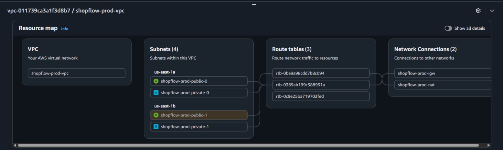
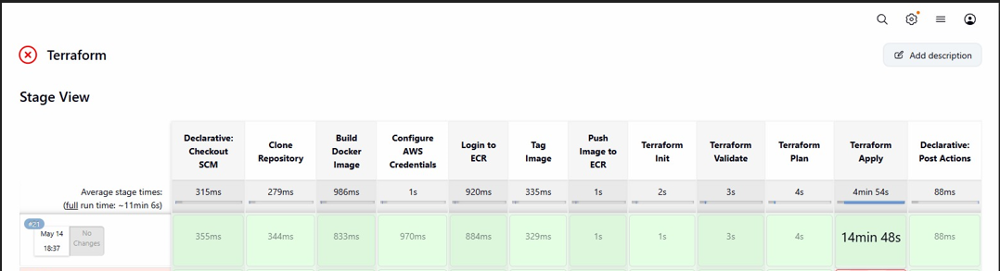
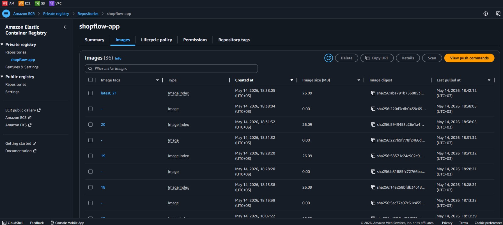
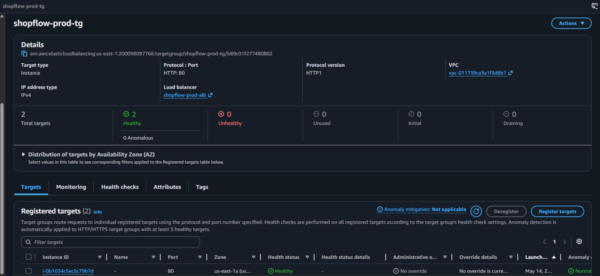
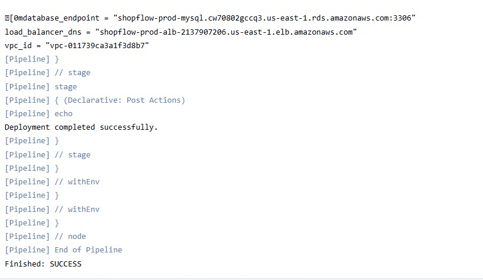
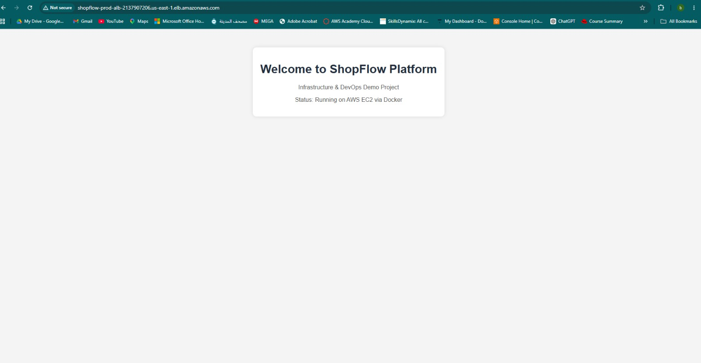

# 🛒 ShopFlow: High-Availability Multi-Tier Infrastructure & CI/CD Pipeline


## 📌 Project Overview
ShopFlow is a robust, production-ready e-commerce infrastructure deployed on AWS using **Terraform** for Infrastructure as Code (IaC). The project features a fully automated **CI/CD Pipeline** that handles application containerization, image versioning in Amazon ECR, and automated infrastructure provisioning.

<p align="center">
  
  <br>
  <em><b>Figure 1:</b> Project Architecture</em>
</p>

---
## 📂 Project Structure

```text
shopflow-infrastructure/
├── main.tf                # Root module to call AWS service modules
├── variables.tf           # Root level input variables
├── outputs.tf             # Main infrastructure outputs (ALB DNS, RDS Endpoint)
├── provider.tf            # AWS Provider & Version configurations
├── backend.tf             # S3 Remote State & DynamoDB Locking config
├── terraform.tfvars       # Environment-specific variable values
├── Jenkinsfile            # Pipeline-as-Code for CI/CD automation
├── .gitignore             # Files to exclude from Git (e.g., .terraform, state)
│
├── modules/               # Reusable infrastructure components
│   ├── vpc/               # Networking: VPC, Subnets, IGW, NAT, Routes
│   │   ├── main.tf
│   │   ├── variables.tf
│   │   └── outputs.tf
│   ├── ec2/               # Compute: ASG, Launch Template, ALB, Target Groups
│   │   ├── main.tf
│   │   ├── variables.tf
│   │   └── outputs.tf
│   ├── rds/               # Database: MySQL Instance, Subnet Groups, SGs
│   │   ├── main.tf
│   │   ├── variables.tf
│   │   └── outputs.tf
│   ├── iam/               # Security: Roles and Instance Profiles for ECR access
│   │   ├── main.tf
│   │   ├── variables.tf
│   │   └── outputs.tf
│   └── monitoring/        # CloudWatch Alarms & SNS Notifications
│       ├── main.tf
│       ├── variables.tf
│       └── outputs.tf
│
└── app/                   # Application source code
    ├── Dockerfile         # Container definition
    └── index.html         # Frontend static content
```
---
## 🛠️ Technologies & Tools Used

| Tool | Purpose |
| :--- | :--- |
| **Terraform** | Infrastructure as Code (IaC) to provision and manage AWS resources. |
| **Jenkins** | Automating the CI/CD pipeline (Build, Push, Deploy). |
| **Docker** | Containerizing the ShopFlow application for consistent environments. |
| **Amazon ECR** | Secure Docker image registry for storing versioned artifacts. |
| **Amazon VPC** | Isolated network with Public/Private subnets across multiple AZs. |
| **AWS EC2 & ASG**| Scalable compute instances with Auto Scaling for self-healing. |
| **AWS ALB** | Application Load Balancer for intelligent traffic distribution. |
| **Amazon RDS** | Managed MySQL database with Multi-AZ for high availability. |
| **AWS S3** | Remote backend for Terraform state storage. |
| **DynamoDB** | State locking to prevent concurrent Terraform executions. |
| **IAM Roles** | Secure, least-privilege access management for AWS services. |
| **GitHub** | Version control and source code management. |
| **Apache/Nginx** | High-performance web servers used within containers. |
---

## 🏗 Architectural Deep-Dive

### 🌐 1. Networking Layer (VPC Module)
Designed for high availability and security isolation:
* **Custom VPC**: CIDR `10.0.0.0/16` providing a massive address space.
* **Multi-AZ Strategy**: Subnets are distributed across **2 Availability Zones** (`us-east-1a` & `us-east-1b`) to eliminate single points of failure.
* **Tiered Subnets**: 
    - **Public Subnets**: Host the Load Balancer and NAT Gateway.
    - **Private Subnets**: Isolate EC2 application servers and RDS instances from direct internet access.
* **NAT Gateway**: Deployed in the Public Subnet to allow private instances to securely fetch updates and pull Docker images while remaining unreachable from the outside.
<p align="center">
  
  <br>
  <em><b>Figure 2:</b> AWS VPC Resource Map </em>
</p>

---

### 🔐 2. Security & Identity (IAM & Security Groups)
Following the **Principle of Least Privilege (PoLP)**:
* **IAM Instance Profile**: Granted `AmazonEC2ContainerRegistryReadOnly` permissions to allow EC2 instances to pull images from ECR securely.
* **Security Group Chaining**:
    - **ALB SG**: Inbound allowed only on Port 80 (HTTP) from `0.0.0.0/0`.
    - **App SG**: Strict inbound rules allowed **ONLY** from the ALB Security Group ID on Port 80. This prevents direct bypass attacks.

---

### 🚀 3. Compute & Scaling (EC2 & ASG Module)
* **Auto Scaling Group (ASG)**: Configured with `Desired: 2`, `Max: 3` to handle traffic spikes.
* **Self-Healing**: Instances that fail Health Checks are automatically terminated and replaced.
* **User Data Automation**: Bash scripts automate the post-provisioning phase:
    - Kernel updates and Docker installation.
    - Automated ECR authentication using AWS CLI.
    - Real-time Docker pull and container execution with port mapping (`80:80`).
---

### ⚖️ 4. Traffic Management (ALB)
* **Application Load Balancer**: Distributes incoming traffic across healthy instances in private subnets.
* **Target Group Health Checks**: Fine-tuned health probes ensuring only functional containers receive user traffic.
---

### 🗄️ 5. Database Layer (RDS)
* **Multi-AZ MySQL**: Synchronous replication across different AZs for disaster recovery.
* **Encryption & Backup**: Enabled automated backups and storage encryption for data persistence.

---

## 🚀 CI/CD Pipeline Workflow (Jenkins)
The pipeline is defined in a `Jenkinsfile` and consists of the following stages:
1. **Source Control**: Triggers on GitHub webhooks.
2. **Build Stage**: Builds a Docker image using the `app/Dockerfile`.
3. **Registry Stage**: Tags and pushes the image to **Amazon ECR** with unique build numbers.
4. **Terraform Init/Validate**: Ensures the IaC code is clean and initialized.
5. **Terraform Plan**: Generates an execution plan for review.
6. **Terraform Apply**: Deploys the infrastructure to AWS.


<p align="center">
  
  <br>
  <em><b>Figure 3:</b> Jenkins Pipeline Stages Success View</em>
</p>


---

## 🛠 Challenges & Solutions
* **Challenge**: S3 Backend Access Denied (403).
    - *Solution*: Identified missing `s3:ListBucket` permissions and corrected the Resource ARN to include `/*` for object access.
* **Challenge**: Target Group Health Check Failures (Unhealthy).
    - *Solution*: Debugged Port Mappings between the Docker Container (80) and the Target Group listener (80). Optimized SG rules to allow ALB-to-App communication.

---

## 📸 Deployment Proofs & Screenshots
1. **Infrastructure Map**: 
  
<p align="center">
  
  <br>
  <em><b>Figure 4:</b> VPC Resource Map</em>
</p>

2. **Container Registry**:
   
<p align="center">
  
  <br>
  <em><b>Figure 5:</b> ECR Images List </em>
</p>

3. **Health Status**:

<p align="center">
  
  <br>
  <em><b>Figure 6:</b> Target Group "Healthy" Status </em>
</p>

4. **CI/CD Outputs**: 

<p align="center">
  
  <br>
  <em><b>Figure 7:</b> CI/CD Outputs Links </em>
</p>

5. **Live App**: 

<p align="center">
  
  <br>
  <em><b>Figure 1:</b>  Browser View of ALB DNS (APP Running) </em>
</p>

---
**Developed by:** [Eslam Harpy](https://github.com/EslamHarpy)
*Infrastructure & DevOps Engineer*
